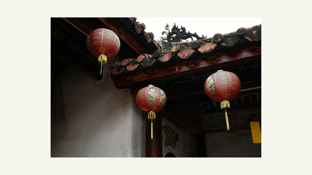

# Photo Slideshow Skill for Claude Code

A [Claude Code](https://claude.ai/claude-code) skill that turns a folder of photos into a polished 4K video slideshow — with a gallery-style matt background, smooth crossfade transitions, and full customisation via plain language.



## What it does

- Takes a folder of photos (JPEG, PNG, HEIC, TIFF, WebP)
- Scales each photo to fill a neutral gallery matt, preserving its aspect ratio
- Renders a 4K H.265 MP4 you can play on any TV, phone, or computer
- Handles EXIF orientation automatically (no sideways photos)
- Installs Python dependencies in an isolated virtual environment — no system Python pollution

**Default style:** warm white matt (`#F5F5F0`), 10% padding, 5-second slides, 0.5-second crossfade, 3840×2160 (4K UHD), H.265.

## Prerequisites

- [Claude Code](https://claude.ai/claude-code)
- [FFmpeg](https://ffmpeg.org/) — install via Homebrew: `brew install ffmpeg`
- Python 3.8+

## Installation

### Option 1 — Install via plugin marketplace (recommended)

Add this repo as a marketplace in Claude Code:

```
/plugin marketplace add hingyeung/photo-slideshow-skill
```

Then install the plugin:

```
/plugin install photo-slideshow@photo-slideshow-skill
```

### Option 2 — Install from source

Clone this repo and copy the skill into your project or user skills directory:

```bash
git clone https://github.com/hingyeung/photo-slideshow-skill.git
cp -r photo-slideshow-skill/skills/photo-slideshow ~/.claude/skills/
```

## Usage

Start a Claude Code session in any directory and describe what you want in plain language:

```
make a slideshow from ~/Photos/Vietnam
```

```
create a 4K video from the photos in ~/Desktop/wedding — 7 seconds per photo
```

```
slideshow from ~/trips/japan with a dark background and no crossfade
```

Claude will ask any clarifying questions, set up the environment, generate the script, and produce the MP4.

## Customisation

You can ask for changes in plain language at any time:

| What you say | What changes |
|---|---|
| "Light grey background" | Matt colour → `#E8E8E8` |
| "Dark / cinema look" | Matt colour → `#1A1A1A` |
| "8 seconds per photo" | Slide duration → 8s |
| "No fade / hard cut" | Crossfade disabled |
| "1080p output" | Resolution → 1920×1080 |
| "More breathing room" | Padding → 15% |
| "Sort by date taken" | Photos sorted by EXIF date |

## Output

The skill produces:

- `generate_slideshow.py` — the rendering script (keep this to re-run or tweak)
- `slideshow-env/` — isolated Python virtual environment
- `slideshow.mp4` (or your specified filename) — the final video

The MP4 is encoded as H.265 (HEVC) at CRF 18 with `+faststart` for streaming. For wider compatibility (older TVs, Windows), ask for H.264 instead.

## Licence

MIT Licence
